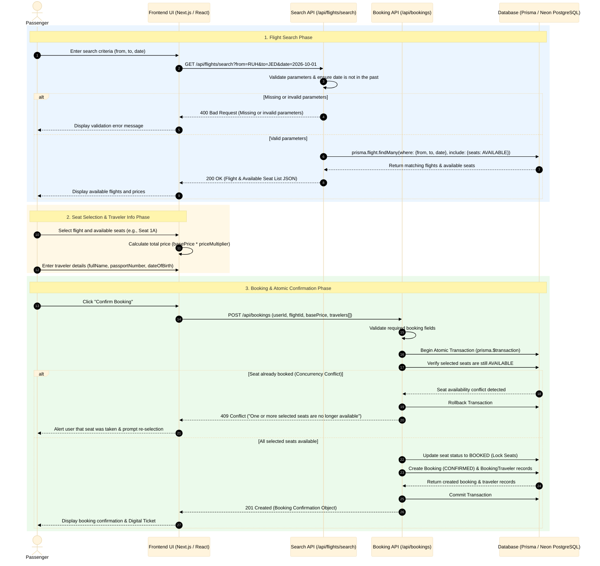

```mermaid
%%{init: {'theme': 'base', 'themeVariables': { 'primaryTextColor': '#000000', 'lineColor': '#333333'}}}%%
sequenceDiagram
    autonumber
    actor Passenger as Passenger
    participant UI as Frontend UI (Next.js / React)
    participant SearchAPI as Search API (/api/flights/search)
    participant BookingAPI as Booking API (/api/bookings)
    participant DB as Database (Prisma / Neon PostgreSQL)

    %% 1. Flight Search Phase
    rect rgb(235, 245, 255)
    Note over Passenger, DB: 1. Flight Search Phase
    Passenger->>UI: Enter search criteria (from, to, date)
    UI->>SearchAPI: GET /api/flights/search?from=RUH&to=JED&date=2026-10-01
    SearchAPI->>SearchAPI: Validate parameters & ensure date is not in the past
    alt Missing or invalid parameters
        SearchAPI-->>UI: 400 Bad Request (Missing or invalid parameters)
        UI-->>Passenger: Display validation error message
    else Valid parameters
        SearchAPI->>DB: prisma.flight.findMany(where: {from, to, date}, include: {seats: AVAILABLE})
        DB-->>SearchAPI: Return matching flights & available seats
        SearchAPI-->>UI: 200 OK (Flight & Available Seat List JSON)
        UI-->>Passenger: Display available flights and prices
    end
    end

    %% 2. Seat Selection Phase
    rect rgb(255, 248, 230)
    Note over Passenger, UI: 2. Seat Selection & Traveler Info Phase
    Passenger->>UI: Select flight and available seats (e.g., Seat 1A)
    UI->>UI: Calculate total price (basePrice * priceMultiplier)
    Passenger->>UI: Enter traveler details (fullName, passportNumber, dateOfBirth)
    end

    %% 3. Booking & Atomic Transaction Phase
    rect rgb(235, 250, 235)
    Note over Passenger, DB: 3. Booking & Atomic Confirmation Phase
    Passenger->>UI: Click "Confirm Booking"
    UI->>BookingAPI: POST /api/bookings (userId, flightId, basePrice, travelers[])
    BookingAPI->>BookingAPI: Validate required booking fields
    
    BookingAPI->>DB: Begin Atomic Transaction (prisma.$transaction)
    BookingAPI->>DB: Verify selected seats are still AVAILABLE
    
    alt Seat already booked (Concurrency Conflict)
        DB-->>BookingAPI: Seat availability conflict detected
        BookingAPI->>DB: Rollback Transaction
        BookingAPI-->>UI: 409 Conflict ("One or more selected seats are no longer available")
        UI-->>Passenger: Alert user that seat was taken & prompt re-selection
    else All selected seats available
        BookingAPI->>DB: Update seat status to BOOKED (Lock Seats)
        BookingAPI->>DB: Create Booking (CONFIRMED) & BookingTraveler records
        DB-->>BookingAPI: Return created booking & traveler records
        BookingAPI->>DB: Commit Transaction
        BookingAPI-->>UI: 201 Created (Booking Confirmation Object)
        UI-->>Passenger: Display booking confirmation & Digital Ticket
    end
    end
```