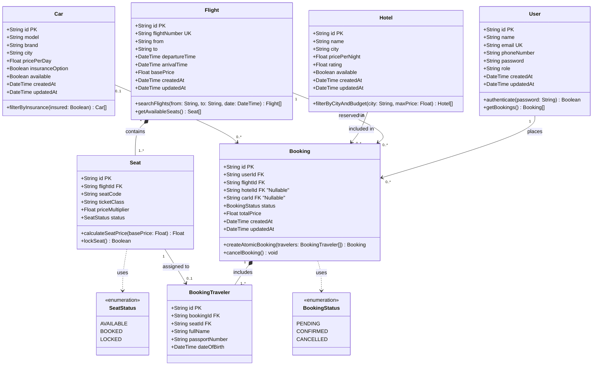

# Tarhal Database Layer — Class Diagram v1

This class diagram models the core database entities (`User`, `Flight`, `Seat`, `Booking`, `BookingTraveler`, `Hotel`, and `Car`), their attributes, data types, domain methods, and multiplicities as implemented in `schema.prisma`.

---

## Entity Relationship Summary

| Source Entity | Target Entity | Multiplicity | Relationship Type & Description |
| :--- | :--- | :--- | :--- |
| **User** | **Booking** | `1` to `0..*` | **Association:** A registered user can place zero or many bookings; each booking belongs to exactly one user. |
| **Flight** | **Seat** | `1` to `1..*` | **Composition:** A flight contains multiple seats; seats cannot exist independently without a parent flight. |
| **Flight** | **Booking** | `1` to `0..*` | **Association:** A flight can be referenced across multiple bookings. |
| **Booking** | **BookingTraveler** | `1` to `1..*` | **Composition:** A booking consists of one or more passenger records (`BookingTraveler`). |
| **Seat** | **BookingTraveler** | `1` to `0..1` | **Association:** Each specific seat on a flight is assigned to at most one traveler per active booking. |
| **Hotel** | **Booking** | `0..1` to `0..*` | **Association:** A booking may optionally include a hotel reservation (and a hotel can be booked many times). |
| **Car** | **Booking** | `0..1` to `0..*` | **Association:** A booking may optionally include a car rental (and a car can be rented across multiple bookings). |