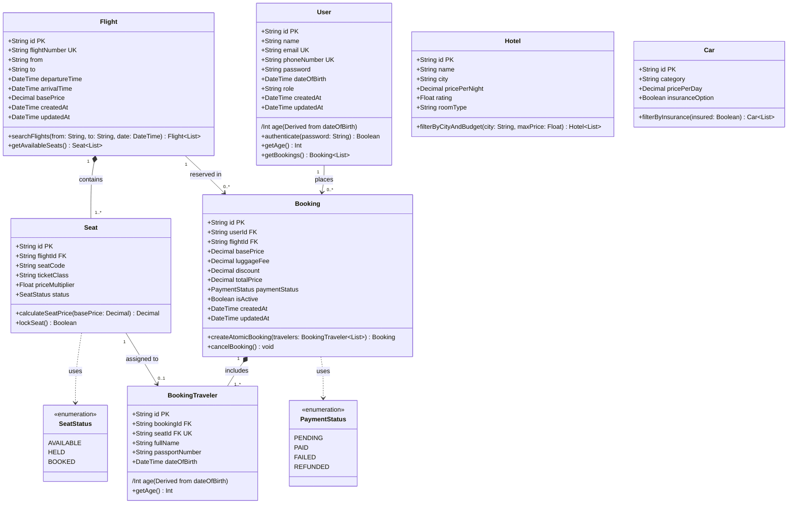

```mermaid
classDiagram
    direction TB

    class User {
        +String id PK
        +String name
        +String email UK
        +String phoneNumber UK
        +String password
        +DateTime dateOfBirth
        /Int age (Derived from dateOfBirth)
        +String role
        +DateTime createdAt
        +DateTime updatedAt
        +authenticate(password: String) Boolean
        +getAge() Int
        +getBookings() Booking~List~
    }

    class Flight {
        +String id PK
        +String flightNumber UK
        +String from
        +String to
        +DateTime departureTime
        +DateTime arrivalTime
        +Decimal basePrice
        +DateTime createdAt
        +DateTime updatedAt
        +searchFlights(from: String, to: String, date: DateTime) Flight~List~
        +getAvailableSeats() Seat~List~
    }

    class Seat {
        +String id PK
        +String flightId FK
        +String seatCode
        +String ticketClass
        +Float priceMultiplier
        +SeatStatus status
        +calculateSeatPrice(basePrice: Decimal) Decimal
        +lockSeat() Boolean
    }

    class SeatStatus {
        <<enumeration>>
        AVAILABLE
        HELD
        BOOKED
    }

    class Booking {
        +String id PK
        +String userId FK
        +String flightId FK
        +Decimal basePrice
        +Decimal luggageFee
        +Decimal discount
        +Decimal totalPrice
        +PaymentStatus paymentStatus
        +Boolean isActive
        +DateTime createdAt
        +DateTime updatedAt
        +createAtomicBooking(travelers: BookingTraveler~List~) Booking
        +cancelBooking() void
    }

    class PaymentStatus {
        <<enumeration>>
        PENDING
        PAID
        FAILED
        REFUNDED
    }

    class BookingTraveler {
        +String id PK
        +String bookingId FK
        +String seatId FK UK
        +String fullName
        +String passportNumber
        +DateTime dateOfBirth
        /Int age (Derived from dateOfBirth)
        +getAge() Int
    }

    class Hotel {
        +String id PK
        +String name
        +String city
        +Decimal pricePerNight
        +Float rating
        +String roomType
        +filterByCityAndBudget(city: String, maxPrice: Float) Hotel~List~
    }

    class Car {
        +String id PK
        +String category
        +Decimal pricePerDay
        +Boolean insuranceOption
        +filterByInsurance(insured: Boolean) Car~List~
    }

    %% Entity Relationships & Multiplicities
    User "1" --> "0..*" Booking : places
    Flight "1" *-- "1..*" Seat : contains
    Flight "1" --> "0..*" Booking : reserved in
    Booking "1" *-- "1..*" BookingTraveler : includes
    Seat "1" --> "0..1" BookingTraveler : assigned to
    Seat ..> SeatStatus : uses
    Booking ..> PaymentStatus : uses
```