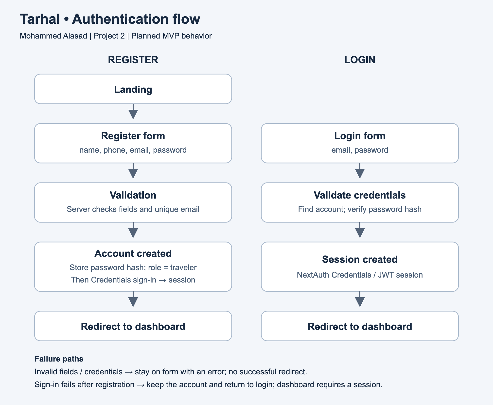

## MVP paragraph for Mohamed Elshiekh

In the MVP, users will register with their name, phone, email, and password and log in through NextAuth.js Credentials authentication, with server-controlled traveler roles and protected access to their dashboard. Hotels will be browsed from eight seeded sample records showing city, nightly price, rating, and a representative room type. Cars will be browsed from five seeded sample categories showing daily prices and whether optional insurance is offered. Both catalogs will use illustrative stored data with no live pricing or availability, and this module will process no real hotel/car reservations, insurance purchases, or payments.

## Authentication flow — 7/9 deliverable

The one-page diagram shows the planned registration and login flows, including the required registration fields and failure handling. Account creation is followed by a successful sign-in before entering the protected dashboard.

[Scalable SVG version](auth-flow.svg)
